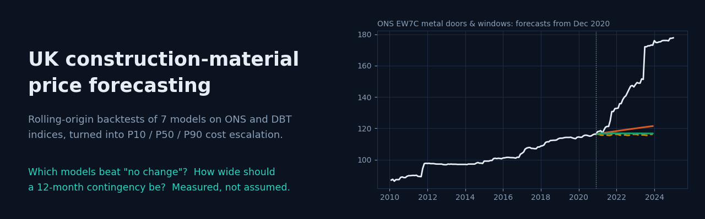
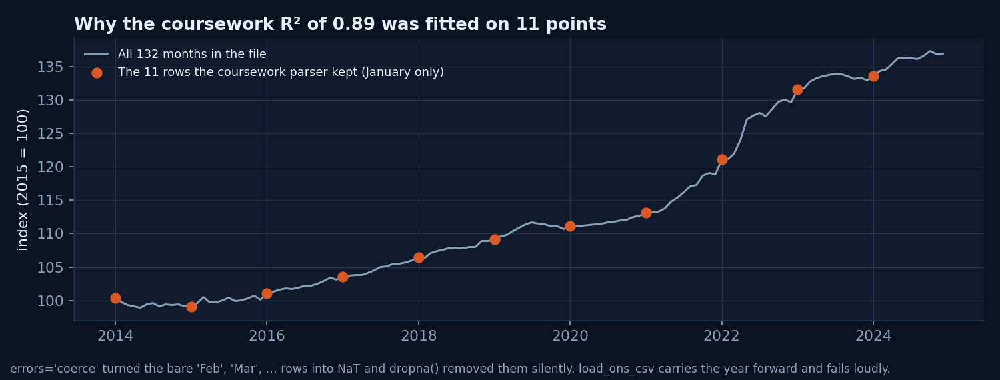
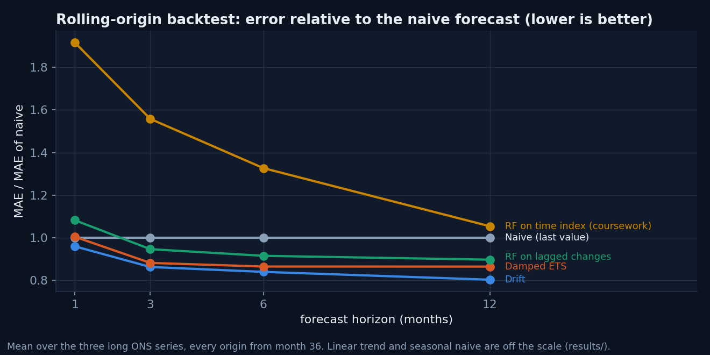
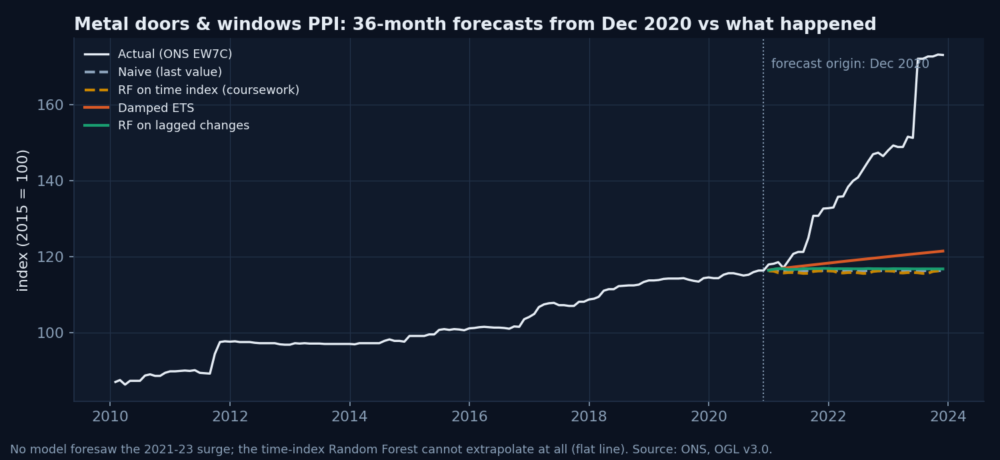
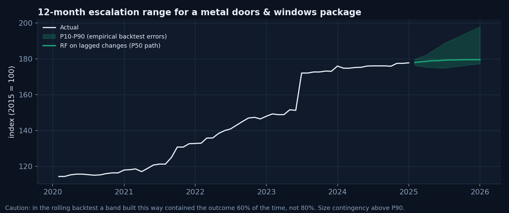

<p align="center"></p>

# UK construction-material price forecasting

[](https://github.com/mohamedragab4554/uk-construction-material-price-forecasting/actions/workflows/ci.yml)

-2dd4bf)


`matprice` forecasts UK construction-material price indices (ONS producer price indices and the DBT construction material price indices). It then turns the forecasts into **P10 / P50 / P90 cost-escalation ranges** for a works package.

The point of the project is evaluation. Every model is scored the way it would be used: fitted only on the past, forecasting 1, 3, 6 and 12 months ahead, at every month of the history. Each score is compared with the simplest possible forecast, "the price stays where it is".

| | |
|---|---|
| **Type** | Academic work, re-engineered. It started as my individual machine-learning component of a group project for COM735 *Machine Learning for Construction* (MSc Digital Construction Analytics & BIM, Ulster University, 2025). In 2026 I rebuilt it as a tested package, with AI pair-programming |
| **Question** | A cost plan priced today is bought 6–18 months later. How much should it be escalated, and how confident can we be? |
| **Data** | 7 public monthly series, 60–180 months each, Open Government Licence v3.0 ([data/README.md](data/README.md)) |
| **Models** | Naive, seasonal naive, drift, linear trend, damped exponential smoothing (ETS), Random Forest on a time index (the coursework model), Random Forest on lagged month-on-month changes |

## Key findings

1. **The original coursework scores were in-sample, and one was fitted on 11 points.** I reproduced every reported number exactly (`matprice coursework`, pinned in tests). The linear regression on the materials index reported R² 0.8946. Its date parser (`errors="coerce"`, then `dropna()`) silently dropped every row except January, so the model saw **11 of 132 months**. The Random Forest R² values of 0.9965 and 0.9996 are fits to the training data, not forecasts.

   

2. **A Random Forest on a time index cannot forecast.** Trees cannot predict outside the range they were trained on, so the forecast is a flat line at the last level. In the rolling backtest it is worse than "no change" at every horizon up to 12 months (1.05–1.92 × the naive error). The test `test_rf_time_index_cannot_extrapolate_but_rf_lags_can` pins this behaviour.

3. **Once evaluated properly, simple models win.** Across the three long ONS series, drift is the best model at every horizon. It cuts the 12-month error by about 20% against no change. Damped ETS and a Random Forest on lagged changes come next. On EW7C at 12 months, the lagged Random Forest is the best (0.68).

   

4. **No model saw the 2021–23 surge coming.** Trained to December 2020, every model forecast about 116–121 for 2023. Metal doors and windows actually reached about 150 before the July 2023 step to 172.

   

### Backtest: mean absolute error relative to the naive forecast (lower is better)

Mean over the three long ONS series (132–180 months, origins from month 36):

| Model | 1 month | 3 months | 6 months | 12 months |
|---|---:|---:|---:|---:|
| **Drift** | **0.96** | **0.86** | **0.84** | **0.80** |
| Damped ETS | 1.00 | 0.88 | 0.86 | 0.86 |
| RF on lagged changes | 1.08 | 0.95 | 0.91 | 0.90 |
| Naive (no change) | 1.00 | 1.00 | 1.00 | 1.00 |
| RF on time index (coursework) | 1.92 | 1.56 | 1.33 | 1.05 |
| Linear trend | 7.68 | 3.22 | 1.90 | 1.17 |
| Seasonal naive | 8.47 | 3.35 | 1.82 | 1.00 |

For scale, the naive 12-month error is about 4.4–7.4 index points (MAPE 3.6–6.5%). Per-series results are in [results/backtest_scores.csv](results/backtest_scores.csv), and every individual forecast is in `results/backtest_errors.csv.gz`.

**The short DBT sector series are a warning, not a result.** They run 2019–2023, so the backtest origins start in 2022, when material inflation peaked and then flattened. There, "no change" beats every trend model at 3 and 12 months: drift scores 1.20–1.27 at 3 months, and the lagged Random Forest 3.6–5.5 at 12 months. A model that extrapolates recent momentum does badly at a turning point. Thirteen 12-month forecasts are also too few to rank models.

## Cost escalation, with an honest interval

```bash
matprice escalate --series ew7c_metal_doors_windows --model rf_lags --horizon 12 --base-cost 100000
```

The P10–P90 band is **empirical**: the distribution of past backtest ratios (actual ÷ forecast) at that horizon, applied to today's forecast. It makes no normality assumption.



| Series (last month) | Model | P10 | P50 | P90 |
|---|---|---:|---:|---:|
| Metal doors & windows, EW7C (Jan 2025) | Damped ETS | +3.7% | +7.0% | +16.9% |
| | RF on lagged changes | −0.3% | +2.8% | +11.3% |
| | Drift | +1.4% | +4.1% | +17.2% |
| Ceramic tiles (Jan 2025) | Damped ETS | −3.5% | +2.4% | +12.7% |
| Materials index (Dec 2024) | Drift | +1.5% | +4.0% | +9.4% |

**Checking the interval.** A nominal 80% band should contain the outcome about 80% of the time. I tested this two ways, with no look-ahead: a static split (calibrate on the first half of the history, test on the second) and a rolling 36-month window that uses only errors already observed.

| 12-month band, rolling 36-month window | Nominal | Achieved |
|---|---:|---:|
| P10–P90 | 80% | **25–60%** |
| P5–P95 | 90% | **30–64%** |

The 3-month bands do better but still fall short, at 58–71%. **These intervals under-cover.** The backtest spans the 2021–23 regime change, and errors from calm years understate the risk of the next shock.

For a cost plan, treat P90 as a lower bound on contingency, not as a 90% guarantee. Add a separately justified risk allowance for supply shocks. [results/escalation_12m.csv](results/escalation_12m.csv) reports all three coverage figures for every series and model.

## Quick start

```bash
pip install -e ".[dev]"            # Python 3.10+
pytest -q                          # 11 tests, a few seconds
matprice coursework                # reproduce the original coursework metrics
matprice backtest --series ceramic_tiles
python scripts/run_benchmark.py    # full benchmark -> results/ and docs/images/ (about 3.5 min, CPU)
```

**Setup:**
- **Windows:** `py -3.11 -m venv .venv; .venv\Scripts\Activate.ps1; pip install -e ".[dev]"`
- **macOS / Linux:** `python3 -m venv .venv && source .venv/bin/activate && pip install -e ".[dev]"`

To update the data, download a newer CSV from the ONS page for the series, save it over the file in `data/raw/`, and rerun the benchmark. The loader rejects any row it can't parse, so a changed layout fails loudly instead of silently shrinking the data.

## Method

| Choice | Why |
|---|---|
| **Rolling origin**, step 1 month, minimum 36 months of training | Every forecast uses only data available at its origin. The test `test_backtest_has_no_lookahead` checks this with a step change |
| **MAE relative to naive** (MASE-like) | Index levels differ between series. A ratio below 1 means the model beats "no change", and that is the only claim that matters to a cost planner |
| **RF on lagged changes**: 12 lagged month-on-month differences, forecast recursively | Modelling changes instead of levels lets a tree model follow a trend it has not seen at that level |
| **Damped ETS** (statsmodels) | Standard trend model whose trend fades with horizon. A reasonable prior for prices |
| **Empirical intervals** from backtest ratios | Honest about each model's own error history. The coverage test shows where that history is not enough |

## Tests

| Test | What it proves |
|---|---|
| Loader keeps all 132 / 180 months and raises on an unparseable row | The coursework parsing bug cannot come back |
| EW7C values match the published ONS series | Data provenance |
| Baselines exact on synthetic series | Naive, drift, trend and seasonal models are correct |
| Time-index RF stays within its training range; lagged RF follows a trend | Finding 2 |
| Step-change backtest | No look-ahead |
| Drift exact on a straight line; naive scores 1.0 | Scoring |
| Escalation quantiles ordered; roughly nominal coverage on stationary noise | Interval code works when its assumptions hold |
| Coursework reproduction: 11 rows, R² 0.8946, 0.4197, RF > 0.99 | Finding 1 |

## Structure

```
src/matprice/
  data.py         ONS / DBT loaders (year carried forward, fails loudly)
  models.py       7 forecasters with one fit / predict interface
  backtest.py     rolling-origin backtest and scoring
  escalation.py   P10/P50/P90 escalation, static and rolling coverage checks
  coursework.py   exact reproduction of the original notebook, bug included
  cli.py          `matprice backtest | escalate | coursework`
scripts/          run_benchmark.py (results + figures), make_banner.py
data/raw/         7 public series (OGL v3.0), provenance in data/README.md
results/          every score, every forecast, escalation and coverage tables
```

## Limits

- **Indices, not quotes.** A national producer price index shows the direction of prices, not what a particular supplier will charge. Regional and project-specific pricing are not modelled.
- **Univariate models only.** No energy prices, exchange rates or demand indicators. Those are the obvious next step, but they need leading indicators to beat drift out of sample.
- **Two series are unverified.** The ceramic tiles and materials index files come from the coursework download, and their ONS series codes were not recorded. EW7C is verified against the ONS page. See [data/README.md](data/README.md).
- **The data ends in January 2025** (EW7C and ceramic tiles; the materials index ends in December 2024). The escalation examples are forecasts from that point, not current advice.
- **Not published:** the original notebook and report. They are assessed coursework from a group project. This repository contains my re-implementation of my own modelling component and my analysis of it.

## Data licence and attribution

Contains public sector information licensed under the [Open Government Licence v3.0](https://www.nationalarchives.gov.uk/doc/open-government-licence/version/3/). Sources: Office for National Statistics (producer price indices), and Department for Business and Trade, *Monthly Statistics of Building Materials and Components*, Table 1a. The code is MIT-licensed ([LICENSE](LICENSE)).

---

Related: [ifc-model-auditor](https://github.com/mohamedragab4554/ifc-model-auditor) (quantities from IFC) · [ec2-crack-width](https://github.com/mohamedragab4554/ec2-crack-width) · Portfolio: **[mohamedragab4554.github.io](https://mohamedragab4554.github.io)**
